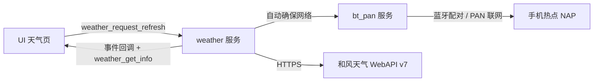

# 数据服务层（services）

> 本层由「设备侧」维护，向上（`src/ui/`）提供**纯数据接口**。
> UI 同事只需 `#include` 对应头文件并调用接口，无需关心蓝牙 / 网络 / HTTP 细节。

## 模块一览

| 模块 | 头文件 | 职责 |
|---|---|---|
| 蓝牙 PAN 联网 | `services/net/bt_pan.h` | 手机蓝牙配对/连接、PAN 网络共享（互联网出口） |
| 天气数据 | `services/weather/weather.h` | 经由 PAN 网络拉取并解析天气，提供「快照 + 状态 + 事件」 |
| 书库管理 | `services/bookshelf/bookshelf.h` | 扫描 TF 卡根目录 TXT 书籍列表（书名/大小/阅读进度） |
| 阅读引擎 | `services/reader/reader.h` | 打开书籍（自动识别 UTF-8/GBK 并统一转 UTF-8 输出）、按“字节偏移”取文本、读写阅读位置 |

## 数据流



## 线程约定（重要）

- 所有对外接口**线程安全**，可在 UI 线程直接调用；
- 所有**事件回调运行在服务线程**：回调里只允许置标志 / `lv_async_call()`，
  严禁直接操作 LVGL；
- 天气刷新是**异步**的：`weather_request_refresh()` 立即返回，
  进度通过状态（回调或轮询）表达。

## 天气状态机

```
IDLE ──request──► REFRESHING ──成功──► UPDATED
                     │
                     ├─失败(有旧数据)──► CACHED （继续显示缓存，状态提示原因）
                     └─失败(无旧数据)──► FAILED
```

| 状态 | UI 建议动作 |
|---|---|
| `WEATHER_STATE_REFRESHING` | 显示“更新中”，按钮置灰 |
| `WEATHER_STATE_UPDATED` | 用 `weather_get_info()` 数据刷新页面，提示“已更新” |
| `WEATHER_STATE_CACHED` | 用 `weather_get_info()` 数据刷新页面（是缓存数据），提示 `info.status`（如“蓝牙未连接”） |
| `WEATHER_STATE_FAILED` | 显示 `info.status` 与重试按钮 |

### 天气快照字段 → 页面元素对照（UI 原型稿 v2.0）

| 页面元素 | 字段 |
|---|---|
| 📍 城市 / 更新时间 | `info.city` / `info.update_time`（格式 "17:05"）|
| 主图标（⛅） | `info.code`（和风天气图标代码，UI 侧映射图标资源；`info.text` 描述文字可直接显示）|
| 大温度 / 体感 / 今日 H·L | `info.temperature` / `info.feels_like` / `info.high` / `info.low` |
| 风：东南风3级 | `info.wind_dir` + `info.wind_scale` |
| 信息卡 8 项 | `info.humidity`（湿度 %）/ `wind_speed`（风速 km/h）/ `visibility`（能见度 km）/ `cloud`（云量 %）/ `sunrise` / `sunset` / `pressure`（hPa）/ `aqi` + `aqi_category` |
| 未来三天预报 | `info.forecast[0..forecast_count-1]`：`date`（"09-24"，UI 可转“明天/后天/周X”）、`text`、`code`、`high`、`low`、`wind_dir`、`wind_scale` |
| “数据来源：本地缓存” | `state == WEATHER_STATE_CACHED`（`UPDATED` = 本次网络数据；`info.status` 为失败原因文本，可直接显示）|

> 城市选择表与原型稿一致：北京/上海/南京/深圳/杭州/成都/广州/西安；`weather_set_city("101190101")`（和风 LocationID，见城市表 `id` 字段）下次刷新生效。

### 天气图标绑定：用 `code` 字段

`info.code`（实况）与 `info.forecast[i].code`（预报）是**同一套「和风天气图标代码」**，
UI 侧只需做一张 `code → 图标资源` 映射表；官方开源图标库（SVG / 图标字体）：

- 图标站点：<https://icons.qweather.com/>（含代码表；GitHub：`qwd/Icons`）

```
100 晴  101 多云  102 少云  103 晴间多云  104 阴
150~153 夜间版（晴/多云/少云/晴间多云）
300 阵雨  301 强阵雨  302 雷阵雨  303 强雷阵雨  304 雷阵雨伴冰雹
305 小雨  306 中雨  307 大雨  308 极端降雨  309 毛毛雨  310 暴雨
311 大暴雨  312 特大暴雨  313 冻雨  314 小到中雨  315 中到大雨
316 大到暴雨  317/318 暴雨到大暴雨  399 雨
400 小雪  401 中雪  402 大雪  403 暴雪  404 雨夹雪  405 雨雪
406 阵雨夹雪  407 阵雪  408 小到中雪  409 中到大雪  410 大到暴雪  499 雪
500 薄雾  501 雾  502 霾  503 扬沙  504 浮尘  507 沙尘暴  508 强沙尘暴
509 浓雾  510 强浓雾  511 中度霾  512 重度霾  513 严重霾  514 大雾  515 特强浓雾
900 热  901 冷  999 未知
```

> 数据源说明（和风天气 WebAPI v7）：
> - `WEATHER_API_HOST` / `WEATHER_KEY` 在 `weather.c` 顶部配置（控制台-设置 / 控制台-项目-凭据），**仅支持 HTTPS**；
> - **根证书**：仅携带 `ISRG Root X1`（和风站点为 Let's Encrypt 证书链），位于 `src/services/weather/certs/`，
>   经 `proj.conf` 的 `CONFIG_PKG_USING_MBEDTLS_EXTRA_CERT_DIRS` 引入；换域名时往该目录补 PEM 即可；
> - **内存**：`project/dpi-hdk_lb57gyd7n6_epd_hcpu/ptab.json` 已将空闲的 ACPU RAM 并入 HCPU（RT 堆 ≈138KB→≈201KB；本工程未启用 ACPU，将来若启用 ACPU 需撤回该改动）；
> - **响应压缩**：和风服务端强制 gzip（`Accept-Encoding` 协商无效），设备侧用内置 miniz（`src/thirdparty/miniz`）解压后再解析；
> - 按量计费**每月前 5 万次请求免费**（实况 + 预报价内）；
> - 预报默认用 `7d` 拿满“未来三天”；若账号权限不足（401/403），把 `WEATHER_DAILY_DAYS` 改成 `"3d"`；
> - 空气质量（AQI）需单独的 air 接口，暂未接入（`info.aqi = -1`，UI 显示 "--"）。

## 使用示例（LVGL 页面伪码）

### 1. 天气页（进入自动更新）

```c
#include "weather.h"

static void weather_page_refresh_async(void *unused)
{
    weather_info_t info;
    weather_get_info(&info);            /* 无论有无数据，info.status 均可显示 */

    /* 用 info.city / info.temperature / info.forecast[] ... 刷新页面控件 */
    lv_label_set_text_fmt(temp_label, "%d℃", info.temperature);
}

static void on_weather_event(weather_state_t state)
{
    /* 服务线程上下文：切回 UI 线程处理 */
    lv_async_call(weather_page_refresh_async, NULL);
}

void weather_page_create(void)
{
    weather_set_event_cb(on_weather_event);
    weather_request_refresh();          /* 进入页面自动更新 */
}
```

### 2. 城市选择页

```c
#include "weather.h"

const weather_city_t *cities;
int count = 0;
cities = weather_get_city_list(&count);     /* 预设城市表 */

/* 用户点“确认”时： */
weather_set_city("101010100");              /* 和风 LocationID，见城市表 cities[i].id */
weather_request_refresh();
```

### 3. 设置页“蓝牙”开关 / 状态栏图标

```c
#include "bt_pan.h"

/* 开关 */
btpan_enable(true_or_false);

/* 状态栏：注册状态变化（单回调槽，UI 内部可再分发） */
void on_bt_state_changed(btpan_state_t state)
{
    /* 服务线程上下文：lv_async_call 切回 UI 线程 */
}

/* 或者轮询（lv_timer 里读状态即可） */
btpan_state_t st = btpan_get_state();
bool net_ok = btpan_is_network_ready();
```

### 4. 书架页 / 阅读页

```c
#include "bookshelf.h"
#include "services/reader/reader.h"

/* 书架：扫描并取列表 */
int n = bookshelf_refresh();
bookshelf_item_t item;
bookshelf_get(i, &item);            /* item.name / item.size / item.progress */

/* 阅读：打开并分页取文本（UI 按 LVGL 度量分页） */
reader_open(item.path);
char buf[256];
uint32_t next;
int len = reader_read_text(offset, buf, sizeof(buf), &next);
/* 渲染 buf（UTF-8），下一页用 offset = next */
reader_set_position(offset);        /* 记录进度 */
```

## 联调说明

- 手机端操作：打开手机蓝牙 → 搜索设备 `RT-EPD-Reader` → 配对连接 →
  在手机侧开启“蓝牙网络共享 / 个人热点（蓝牙）”。
- 设备侧自动流程：配对/加密完成 → 3 秒后自动发起 PAN 连接；
  天气请求时会再次确保网络（未连时自动请求连接并等待）。
- 书库：把 `.txt` 书籍放在 **TF 卡根目录**（卡需 FAT32 格式；只扫描根目录一层，
  不含子文件夹），`ls` 能看到的 `.txt` 即会被 `svc bookshelf list` 列出；
  列表按书名排序，`item.name` 为去掉 `.txt` 后缀的书名。
- 串口调试命令（msh）：

```
svc                          # 列出所有服务与子命令
svc weather status           # 打印天气快照（全部字段）
svc weather refresh          # 请求刷新并等待结果后打印
svc weather city [id]        # 查看/设置城市
svc pan status|on|off|connect
svc bookshelf list           # 扫描并打印书库
svc reader open <path>       # 打开书籍
svc reader info              # 书籍信息 + 当前位置
svc reader read [offset] [len]  # 按偏移读取一段文本
svc reader next [len]        # 从当前位置读取并前进
svc reader seek <offset>     # 设置阅读位置
```

## 待办（后续迭代）

- [ ] 天气缓存持久化（重启后仍可显示上次数据）
- [ ] 空气质量（AQI，需和风 air 接口单独请求）
- [ ] 城市选择的持久化（FlashDB）
- [ ] reader：BIG5 编码转换（GBK 已支持自动检测并转 UTF-8）
- [x] 阅读 UI：通过 `ui_bookshelf_data.c` 在 `/.epd_reader/` 保存原文件偏移、页码和进度；
  `reader_set_position()` 本身只更新服务内存位置。
